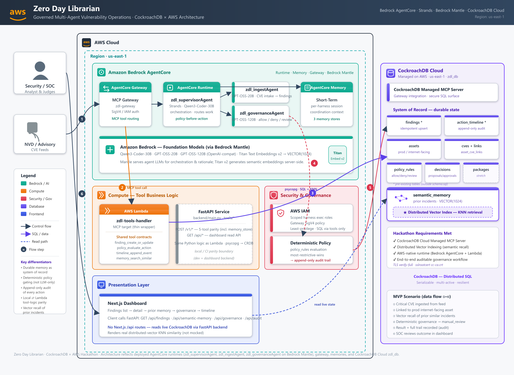

# Zero Day Librarian

Zero Day Librarian (ZDL) is a multi-agent vulnerability management system built on Amazon Bedrock AgentCore. It ingests CVE intelligence, links findings to assets, enforces governance policies, applies governance-approved remediations, and maintains a full audit trail — backed by CockroachDB Cloud with distributed vector indexing for semantic memory.

**Live demo:** https://d1d6jt5wolf23m.cloudfront.net — open the top finding (CVE-2024-7169) to see semantic-memory recall, the governance decision, and the audit timeline, all served live from CockroachDB Cloud.



## Architecture

```bash
zerodaylib/
├── agentcore/             # AgentCore project config (agentcore.json, CDK)
├── app/                   # Agent runtimes (Strands + BedrockAgentCoreApp)
│   ├── zdl_supervisorAgent/   # Orchestration agent — routes work to specialists
│   ├── zdl_ingestAgent/       # Ingestion agent — normalizes CVE + asset data
│   ├── zdl_governanceAgent/   # Governance agent — policy evaluation and approvals
│   └── zdl_remediationAgent/  # Remediation agent — applies governance-allowed patches
├── backend/               # FastAPI tool service + CockroachDB integration
│   ├── main.py            # HTTP API (tool contracts + frontend endpoints)
│   ├── tools/             # Tool logic: finding, policy, timeline, memory, remediation
│   ├── db/                # Schema, seed SQL, and Titan embedding seed script
│   ├── embed.py           # Bedrock Titan Text v2 embedding client
│   ├── lambda_handler.py  # AWS Lambda MCP handler (same contracts as FastAPI)
│   └── iam/               # IAM policy documents
├── frontend/              # Next.js dashboard (TypeScript + Tailwind)
├── docs/                  # Architecture diagram, deploy runbook, project narrative
├── scripts/               # Dev helpers (dev.sh / dev.ps1)
└── specs/                 # Internal design specs (not published — see .gitignore)
```

## Agents

All four agents are deployed to **Amazon Bedrock AgentCore Runtime** (`us-east-1`) using the Strands framework on Python 3.14. Each agent connects to a shared AgentCore Gateway for MCP tool access and has its own persistent memory session.

| Agent | Role |
|-------|------|
| `zdl_supervisorAgent` | Orchestrates the pipeline; routes work to ingestion, governance, and specialist agents |
| `zdl_ingestAgent` | Normalizes CVE advisories, SBOMs, and asset inventory into structured DB records |
| `zdl_governanceAgent` | Enforces policy rules; returns `allow`, `deny`, or `manual_review` for workflow actions |
| `zdl_remediationAgent` | Applies the remediation governance explicitly `allow`ed via `apply_patch_action`; refuses `manual_review`/`deny` findings server-side |


## Backend Tool Service

The FastAPI service (`backend/main.py`) exposes:

**Tool contract endpoints (used by agents via MCP gateway):**

- `POST /v1/finding_create_or_update` — idempotent finding upsert
- `POST /v1/policy_evaluate_action` — deterministic allow/deny/manual_review
- `POST /v1/timeline_append_event` — append audit event
- `POST /v1/memory_search_similar` — KNN vector search over semantic memory
- `POST /v1/memory_store` — persist resolved incidents to semantic memory
- `POST /v1/apply_patch_action` — apply a governance-`allow`ed remediation (refuses `manual_review`/`deny` server-side)

**Frontend read endpoints:**

- `GET /api/findings` — list all findings
- `GET /api/findings/{id}` — finding detail
- `GET /api/semantic-memory/{finding_id}` — similar prior incidents (live Titan embedding + KNN)
- `GET /api/audit/{finding_id}` — audit timeline events
- `GET /api/governance/{finding_id}` — governance decision status

The Lambda handler (`backend/lambda_handler.py`) exposes the same tool contracts for cloud deployment via the AgentCore Gateway MCP target.

## Database Schema

Deployed to **CockroachDB Cloud** (`zdl_db`, `us-east-1`). Key tables:

| Table | Description |
|-------|-------------|
| `findings` | Security findings with CVE mappings, severity, and decision state |
| `assets` | Asset inventory (type, environment, exposure, owner) |
| `cves` | CVE metadata (CVSS score, severity, affected packages) |
| `packages` | Software packages installed on assets |
| `asset_cve_links` | Many-to-many asset ↔ CVE relationship |
| `policy_rules` | Deterministic allow/deny/manual_review policy rules |
| `decisions` | Governance decisions with rationale and audit trail |
| `semantic_memory` | Prior incidents with 1024-dim Titan vector embeddings |
| `action_timeline` | Full audit timeline of all agent and user actions |

CockroachDB features used:

- Distributed vector index (`CREATE VECTOR INDEX`) on `semantic_memory.embedding` for KNN search
- JSONB columns for flexible incident data, policy predicates, and proposals
- UUID primary keys with `gen_random_uuid()`
- Computed columns for idempotency (`decisions.action_id`)
- Temporal indexing on `action_timeline`

## Local Development

### Prerequisites

- Python 3.11+
- Node.js 18+ and npm
- AWS credentials with `bedrock:InvokeModel` access (for Titan embeddings)
- `COCKROACH_URL` pointing to a CockroachDB Cloud cluster

### Setup

1. Set `COCKROACH_URL` in `agentcore/.env.local`:

   ```bash
   COCKROACH_URL="postgresql://<user>:<pass>@<cluster>.cockroachlabs.cloud:26257/zdl_db?sslmode=verify-full"
   ```

2. Apply the database schema (first time only):

   ```bash
   cockroach sql --url "$COCKROACH_URL" -f backend/db/schema.sql
   cockroach sql --url "$COCKROACH_URL" -f backend/db/seed.sql
   ```

3. Start the full stack:

   ```bash
   npm run dev            # starts backend (port 8000) + frontend (port 3000)
   npm run dev:clean      # same, but wipes the frontend .next cache first
   npm run dev:backend    # backend only
   npm run dev:frontend   # frontend only
   ```

   The dev script auto-installs dependencies, loads `COCKROACH_URL` from `agentcore/.env.local`, and backfills any `semantic_memory` rows missing Titan embeddings.

   > Use `npm run dev:clean` after editing a route's `generateStaticParams` / `dynamicParams`
   > exports — Next.js's dev server caches route metadata and otherwise reports a stale
   > "missing generateStaticParams()" error.

4. Open `http://localhost:3000` for the dashboard, or `http://localhost:8000/docs` for the FastAPI Swagger UI.

### Backend Configuration (optional env vars)

The backend reads the following optional environment variables. All have safe
defaults suitable for the demo, so none are required for local dev.

| Variable | Default | Used by |
|----------|---------|---------|
| `COCKROACH_URL` | local dev URL | DB connection (required in cloud) |
| `ZDL_ENVIRONMENT` | `production` | `/api/system` environment label |
| `ZDL_REGION` | `us-east-1` | `/api/system` region label |
| `ZDL_VERSION` | `0.4.0` | `/api/system` version label |
| `ZDL_GIT_COMMIT` | `unknown` | `/api/system` build commit (sidebar footer) |
| `ZDL_CRDB_NODES` | `3` | `/api/system` fallback node count when `crdb_internal.gossip_nodes` is not readable |
| `ZDL_BEDROCK_REGION` | value of `ZDL_REGION` | `/api/system` Bedrock region label |
| `ZDL_AGENT_COUNT` | `4` | `/api/system` AgentCore agent count |

`ZDL_GIT_COMMIT` is surfaced in the dashboard sidebar footer. To inject the
current commit at deploy/run time:

```bash
export ZDL_GIT_COMMIT="$(git rev-parse --short HEAD)"
```

The dev scripts (`scripts/dev.sh` / `scripts/dev.ps1`) populate it automatically.

### Running Tests

Tests run against the live CockroachDB Cloud database:

```bash
# Export COCKROACH_URL, then:
pytest                                                  # all tests
pytest backend/tests/test_tools.py::test_memory_vector_knn  # specific test
```

### Refreshing Titan Embeddings

To manually backfill Titan Text v2 embeddings for `semantic_memory` rows:

```bash
export $(grep '^COCKROACH_URL=' agentcore/.env.local | sed 's/"//g')
python -m backend.db.seed_embed
```

## Cloud Deployment

Agents are deployed via **Amazon Bedrock AgentCore** to AWS account `606713070136` in `us-east-1`.

```bash
# From repo root:
agentcore deploy       # synthesizes CDK, deploys all runtimes + gateway
agentcore status       # check deployment status
agentcore invoke       # invoke an agent
```

Or directly via CDK:

```bash
cd agentcore/cdk
npm install
npx cdk deploy
```

See `agentcore/agentcore.json` for the full runtime, memory, and gateway configuration, and `AGENTS.md` for schema reference and CLI commands.

## Frontend Deployment (S3 + CloudFront + API Lambda)

The Next.js dashboard is deployed as a **static export** to S3 behind **CloudFront**, and its `/api/*` read endpoints run as a **Lambda** (the FastAPI app in `backend/main.py` wrapped with Mangum) behind **API Gateway**. A single CloudFront distribution fronts both:

- default behavior → private S3 bucket (Origin Access Control)
- `/api/*` behavior → API Gateway → Lambda

Because the browser calls `/api/*` same-origin, no CORS round-trips are needed. Deep links for the dynamic `/finding/<id>` route are handled by a CloudFront Function that rewrites them to the exported SPA shell.

The frontend infrastructure lives in a separate CDK stack (`agentcore/cdk/lib/frontend-stack.ts`) within the same CDK app. It is **opt-in**: it only synthesizes when `ZDL_COCKROACH_SECRET_ARN` is set and the build artifacts exist, so the standard `agentcore deploy` flow is unaffected.

### Prerequisites

- Docker (to build ARM64 Lambda wheels)
- A Secrets Manager secret in `us-east-1` holding the CockroachDB connection URL (reuse the one the AgentCore tools Lambda uses)

### Steps

```bash
# 1. Build the static frontend export → frontend/out/
#    IMPORTANT: the deployed dashboard calls /api/* SAME-ORIGIN, so the build
#    must inline an EMPTY NEXT_PUBLIC_API_BASE_URL. .env.local (dev) sets it to
#    localhost and overrides .env.production, so force the empty value via
#    .env.production.local (which overrides .env.local for production builds).
#    Skip this and the deployed bundle hard-codes http://127.0.0.1:8000 and
#    every dashboard API call fails with ERR_CONNECTION_REFUSED.
#    (build:clean wipes the .next/out cache first so a stale route cache can
#    never trigger the "missing generateStaticParams()" export error)
cd frontend && npm ci
printf 'NEXT_PUBLIC_API_BASE_URL=\n' > .env.production.local
npm run build:clean && cd ..

# 2. Build the API Lambda zip → dist/zdl-api-handler.zip (needs Docker)
bash backend/package_api_lambda.sh

# 3. Build the shared psycopg layer once → dist/zdl-tools-layer.zip (needs Docker)
bash backend/package_lambda.sh --layer

# 4. Deploy the frontend stack (set the CockroachDB secret ARN)
cd agentcore/cdk && npm install
ZDL_COCKROACH_SECRET_ARN="arn:aws:secretsmanager:us-east-1:606713070136:secret:zdl/cockroach-url-XXXXXX" \
  npx cdk deploy AgentCore-zerodaylib-default-Frontend
```

The stack outputs `FrontendUrl` (the CloudFront `*.cloudfront.net` URL for the dashboard), `ApiEndpoint`, and `SiteBucketName`.

Optional env var overrides for artifact locations: `ZDL_FRONTEND_OUT_DIR`, `ZDL_API_HANDLER_ZIP`, `ZDL_PSYCOPG_LAYER_ZIP`.

> Note: the `/api/*` endpoints are deployed **publicly (no auth)** for the demo. Add authentication (Cognito, API key, or WAF) before any non-demo use.


## License

MIT
